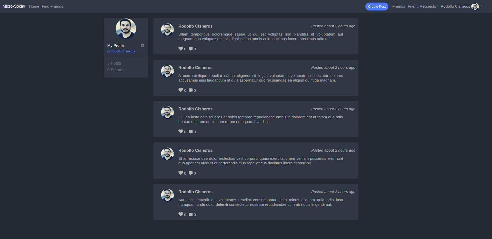

# [Micro-social](https://micro-social.herokuapp.com/)



## Table of content

- [Description](#description)
- [Technologies](#technologies)
- [Installation](#installation)
- [Authors](#authors)

## Description

[Micro-social](https://micro-social.herokuapp.com/) is a basic social network, mirroring basic Facebook features built in Ruby on Rails

## Technologies

Ruby version:

```
$ ruby-2.5.1
```

Rails version:

```
$ rails-6.0.0
```

## Installation

1. Clone the project to your local directory

```
git clone https://github.com/rociac/micro-facebook
```

2. Run `bundle install`

3. Run `rails db:migrate`

4. Run `rails db:seed` (Optional)

## Automated Tests
- Currently, there are no automated tests avaailable for this project. This will be implemented at a later date.

## Planned Features
- Refactor this application into a microservice/API.

## Authors

- [Rodolfo Cisneros](https://github.com/rociac)

- [Adebola Adeniran](https://github.com/onedebos)
